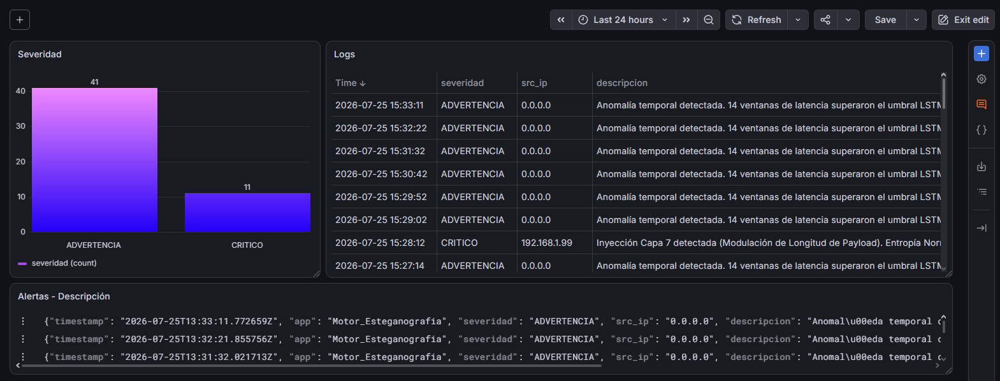

# Orquestador de Seguridad y Detección de Esteganografía en Redes

Este repositorio contiene la implementación de un sistema avanzado de seguridad en redes que simula un entorno continuo de "Blue Team vs Red Team". El proyecto coordina la generación de tráfico (legítimo y malicioso), analiza las capturas en busca de canales encubiertos mediante inteligencia artificial y entropía, y exporta alertas estructuradas para su monitorización en tiempo real.

---

## 1. Los 4 Vectores de Ataque (Scripts Malignos)

Los scripts ofensivos buscan evadir los sistemas de detección inyectando el mensaje "PolHackedYou:)" cifrado con Vernam y una clave precompartida. Todos los scripts inyectan el tráfico malicioso camuflado entre 500 paquetes de ruido ("chaff") por cada paquete portador de información.

### Tabla Comparativa de Ataques

| Característica | Capa 3 (`inyector_capa3_ip.py`) | Capa 4 Retardos (`inyector_capa4_ipat.py`) | Capa 4 Puertos (`inyector_capa4_puertos.py`) | Capa 7 (`inyector_capa7_payload.py`) |
| :--- | :--- | :--- | :--- | :--- |
| **Mecanismo** | Altera los campos de la cabecera IP. | Altera el tiempo de llegada entre paquetes (IPAT). | Altera el puerto de origen UDP. | Altera la longitud del paquete UDP. |
| **Ocultación del Byte** | 1 bit a `Flags`, 3 bits a `TOS`, 2 bits a `TTL`, 2 bits a `IP ID`. | El retardo es `0.050 + (byte * 0.001)` segundos. | Se integra en el puerto usando <code>(prefix &lt;&lt; 8) &#124; byte</code>. | El tamaño del payload es `1000 + byte`. |
| **Decodificación** | Ensamblaje binario de los múltiples campos IP leídos. | Resta del tiempo absoluto entre paquetes secuenciales. | Aplicación de máscara AND (`0xFF`) sobre el puerto. | Cálculo de la longitud de la capa `Raw` menos 1000. |

---

## 2. Generador de Tráfico Benigno (`generador_benigno.py`)

Este script cumple un propósito fundamental, pero su rol cambia radicalmente dependiendo de la fase en la que se encuentre el sistema:

*   **Fase de Entrenamiento Inicial (Offline):** Antes de arrancar el orquestador, este generador se utiliza para crear una captura inicial de tráfico 100% legítimo y libre de anomalías. El script `entrenador_ia.py` consume esta captura para entrenar la red neuronal LSTM por única vez, estableciendo la *baseline* matemática y el umbral estático de lo que se considera una red "sana".
*   **Fase de Simulación (En vivo):** Una vez que arranca el orquestador, el modelo de IA ya no aprende. Durante esta fase, el script benigno se ejecuta con alta frecuencia (11 de cada 15 ciclos). Su único objetivo aquí es generar "ruido de fondo" constante que simule la actividad diaria de los usuarios. Esto crea un entorno de red realista y saturado, indispensable para poner a prueba la capacidad de los ataques esteganográficos para camuflarse.

---

## 3. El Cortafuegos / IDS (`detector_stegano_quic_mejorado3.py`)

A diferencia del orquestador, el firewall es el verdadero núcleo inteligente del proyecto. Extrae las cabeceras (IP de origen, flags, TOS, ID, TTL, puertos origen, tamaño del payload y tiempos absolutos) del archivo `captura_quic.pcap` y procesa los datos en dos hilos concurrentes:

### Hilo 1: Motor Espacial (Entropía Multidimensional)
Analiza matemáticamente las cabeceras buscando patrones esteganográficos:
*   Calcula la **Entropía de Shannon** para identificar la aleatoriedad en los identificadores IP, el TOS, los puertos y los tiempos (IPAT).
*   Normaliza la entropía dividiéndola entre la entropía máxima posible para evitar sesgos por el volumen de paquetes.
*   **Detección:** Si se supera el umbral de entropía en campos como los puertos origen (indicando *Port Hopping*) o la varianza del tamaño de payload supera 50, confirma el canal encubierto y emite alertas de severidad `CRITICO` asociadas a la IP atacante.

### Hilo 2: Motor IA Temporal Global (LSTM)
Evalúa la red en su conjunto (sin fijarse en IPs específicas) analizando el flujo de tiempos a través de una Inteligencia Artificial:
*   Carga en memoria un modelo pre-entrenado de Red Neuronal LSTM (`modelo_lstm.keras`), un escalador (`scaler_ia.pkl`) y un umbral de error.
*   Extrae características avanzadas de ventanas temporales de 30 paquetes: media, varianza, entropía del histograma, asimetría (skew) y curtosis.
*   Si el error de reconstrucción (MSE) supera el umbral precalculado, infiere que hay un patrón rítmico artificial en los retardos (exfiltración por latencia o DDoS) y emite una advertencia global (`ADVERTENCIA`) sin identificar una IP específica (`0.0.0.0`).
*   Genera visualmente el gráfico `reporte_lstm_ultimo.png` con la curva temporal y el umbral de alarma.

---

## 4. El Orquestador: El Motor de Simulación (El "Ejecutor Tonto")

Es fundamental entender que **el orquestador (`orquestador.py`) es un componente completamente "tonto"**; no realiza ningún cálculo analítico, no lee paquetes y no inspecciona la red. Su única responsabilidad es coordinar la ejecución de los scripts de forma cíclica e ininterrumpida.

El ciclo de vida que sigue el orquestador es estrictamente el siguiente:
1.  **Tirada de Probabilidad:** Genera un número aleatorio del 1 al 15.
2.  **Selección de Tráfico:** 
    *   Si el número es entre 1 y 11 (probabilidad de 11/15), selecciona el script de tráfico benigno.
    *   Si el número es 12, 13, 14 o 15 (probabilidad de 1/15 cada uno), selecciona uno de los cuatro scripts de malware (Ataques).
3.  **Ejecución Ciega:** Utiliza `subprocess.run` para ejecutar el generador de tráfico elegido sin saber qué hace internamente.
4.  **Espera de Volcado:** Pausa su ejecución durante 5 segundos para permitir que el generador termine de escribir el archivo `.pcap` en el disco.
5.  **Lanzamiento del IDS:** Ejecuta el script del cortafuegos (`detector_stegano_quic_mejorado3.py`), delegándole todo el trabajo analítico.
6.  **Enfriamiento:** Realiza una cuenta atrás de 30 segundos para estabilizar la red antes de iniciar el siguiente ciclo.

---

## 5. Generador de Logs Estructurados (JSON)

Cuando el Cortafuegos detecta una intrusión (ya sea por entropía o por LSTM), invoca la función `enviar_alerta_wazuh` para estructurar la salida.
*   **Ruta de destino:** Los eventos se agregan en formato JSON al archivo local `C:\logs_firewall\alertas.json`.
*   **Esquema de datos:** Cada línea del archivo es un objeto independiente que contiene:
    *   `timestamp`: Marca temporal en formato ISO 8601 UTC.
    *   `app`: Identificador del sistema (`Motor_Esteganografia`).
    *   `severidad`: Clasificación del impacto (`ADVERTENCIA` o `CRITICO`).
    *   `src_ip`: La IP identificada, o `0.0.0.0` para alarmas globales temporales.
    *   `descripcion`: Motivo técnico del disparo del IDS (ej. *Inyección Capa 7 detectada...*).

---

## 6. Pila de Observabilidad (Loki / Grafana)

El archivo `alertas.json` sirve como puente de comunicación hacia la pila de monitorización:
*   **Grafana Alloy:** Un agente en segundo plano monitoriza constantemente el archivo de texto. Al detectar nuevas líneas, extrae las etiquetas (como la severidad) y reenvía el flujo de logs hacia la base de datos de telemetría.

---

## 7. Monitorización Visual (Dashboard de Grafana)

Para facilitar la auditoría en tiempo real y la respuesta ante incidentes, el sistema cuenta con un panel de control operativo en Grafana que consume directamente los datos indexados por Loki. 

### Consultas LogQL de Referencia
El panel se alimenta de las siguientes consultas principales:
*   **Captura de eventos del cortafuegos:** `{job="firewall_stegano"}`
*   **Distribución de alertas por severidad:** `sum by (severidad) (count_over_time({job="firewall_stegano"}[$__range]))`

### Ejemplo del Panel de Control
A continuación se muestra un ejemplo del dashboard en vivo. En él se puede observar el balance porcentual de las alertas categorizadas (Gráfico de Tarta) y la tabla de auditoría estructurada con la extracción nativa de los campos JSON (`src_ip`, `severidad`, `descripcion`):

*(Nota: El sistema está diseñado para que los analistas puedan identificar de un vistazo las IPs bloqueadas por el Motor Espacial o las advertencias globales emitidas por el Motor IA).*
*   **Grafana Loki:** Almacena e indexa estos logs estructurados de forma altamente eficiente.
*   **Paneles de Grafana:** Consumen los datos de Loki para generar gráficos (basados en las llaves `severidad` del JSON) y tablas de auditoría en tiempo real donde los analistas pueden revisar de un vistazo las IPs bloqueadas (`src_ip`) y las anomalías de entropía (`descripcion`).
